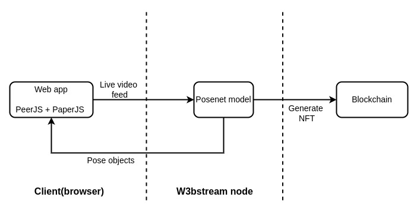

# SigNature
## About 

This project uses [Pose estimation](https://www.tensorflow.org/lite/examples/pose_estimation/overview#:~:text=Pose%20estimation%20is%20the%20task,key%20body%20joints%20(keypoints).) to animate human movements when 2 actors interact with each other. The captured animation is used to create an NFT. 

The NFT acts as an acknowledgment of an interaction. Interaction can mean various things:

- Meeting a certain actor ( perhaps a famous individual )
- Acceptance of an award or acknowledgment ( e.g. if you were a prize winner in an online completion )
- Agreement of certain terms 
- And so on…

*This approach (of NFT generation) aims to preserve the aspects of human interaction that would exist in a physical environment when interacting from a digital one.*

For example, one can still be expressive when digitally signing an agreement. The NFT generated from the metadata of this interaction would be the proof of the underlying agreement. 

### Focus
As shown above, many possible use cases exist for NFT generation using pose estimation + animations. 

However, **the project in this repo will be about the generation of Commemorative NFTs.** The project is called SigNature ( pronounced Sign-Nature ).

The target areas for generating commemorative NFTs are: 

- prize-giving ceremony after a hackathon
- player interaction after a tournament/ game

The intention for these target areas is to encourage:

1) the community <> contributors to use this for NFT generation
2) game  developers to integrate this 

## Motivation 
This project was partly inspired by my previous project, whose aim was to ensure that *NFT objects could interact with each other* (i.e. digitally alive). The project, called [DNN](https://github.com/Mberic/dnn) (Digital Native NFTs), was a Prize Pool winner for the Cartesi 2024 Hackathon. 

The approach in DNN required using geometric objects. This presented some limitations, particularly regarding the expressiveness of an NFT creator(s).

However, after some research, I realized that using a pose estimation ML model could resolve these challenges. When coupled with animation, the possibilities to pose estimation become limitless. 

## How it Works

Please check the [README in frontend directory](./frontend/README.md)

## Tools 

- [Posenet model](https://github.com/tensorflow/tfjs-models/tree/master/pose-detection) - to generate Pose objects from video feed. Pose objects are key points of the human body
- [PeerJS](https://peerjs.com/) - to connect 2 peers
- Paper.js - to animate the SVG images using the Pose objects

## Design
### Architecture 

### Description 

SigNature is a video communication app which uses **Pose Animation to generate an NFT from the digital interaction** between users. We use the term **Pose animation** to mean creating animations from Pose estimation.

There can optionally be some data (text) as part of the interaction. This message can be something like: “0xdea shook hands with 0xbeef at 12:15 UTC. Oxdea has been awarded for his participation in the hackathon.”

## Features 

- Real-time interaction (i.e generation of an "interaction NFT")
- After the prize-giving ceremony, partcipants can share the ceremony moments on social media platforms. This wouldn't be possible if our perception of a digital agreement was restricted to the cryptography. 

## References 
- [Pose estimation](https://www.tensorflow.org/lite/examples/pose_estimation/overview#:~:text=Pose%20estimation%20is%20the%20task,key%20body%20joints%20(keypoints).)
- [Pose Animator by Shan Huang](https://github.com/yemount/pose-animator)
