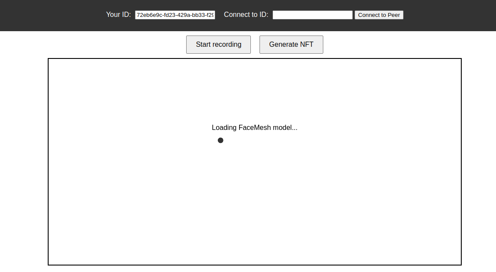
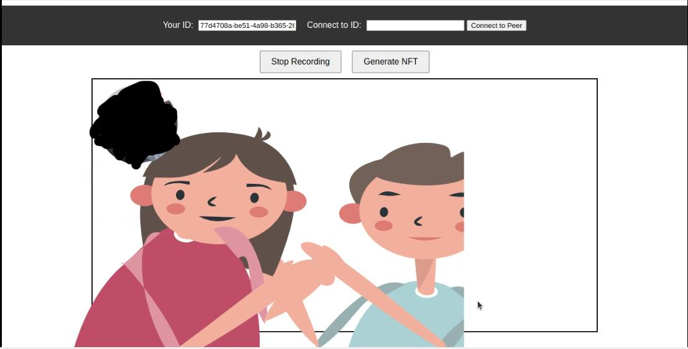
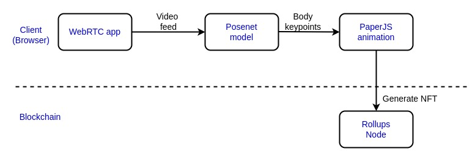

# SigNature
## About 

This project uses [Pose estimation](https://www.tensorflow.org/lite/examples/pose_estimation/overview#:~:text=Pose%20estimation%20is%20the%20task,key%20body%20joints%20(keypoints).) to animate human movements when 2 actors interact with each other. The captured animation is used to create an NFT. 

The NFT acts as an acknowledgment of an interaction. Interaction can mean various things:

- Meeting a certain actor ( perhaps a famous individual )
- Acceptance of an award or acknowledgment ( e.g. if you were a prize winner in an online completion )
- Agreement of certain terms 
- And so on…


*This approach (of NFT generation) aims to preserve the aspects of human interaction that would exist in a physical environment when interacting from a digital one.*


For example, one can still be expressive when digitally signing an agreement. The NFT generated from the metadata of this interaction would be the proof of the underlying agreement. 

### Focus
As shown above, many possible use cases exist for NFT generation using pose estimation + animations. 

However, **the project in this repo will be about the generation of Commemorative NFTs.** The project is called SigNature ( pronounced Sign-Nature ).

The target areas for generating commemorative NFTs are: 

- prize-giving ceremony after a hackathon
- player interaction after a tournament/ game

The intention for these target areas is to encourage:

1) the community <> contributors to use this for NFT generation
2) game  developers to integrate this 

## Motivation 
This project was partly inspired by my previous project, whose aim was to ensure that *NFT objects could interact with each other* (i.e. digitally alive). The project, called [DNN](https://github.com/Mberic/dnn) (Digital Native NFTs), was a Prize Pool winner for the Cartesi 2024 Hackathon. 

The approach in DNN required using geometric objects. This presented some limitations, particularly regarding the expressiveness of an NFT creator(s).

However, after some research, I realized that using a pose estimation ML model could resolve these challenges. When coupled with animation, the possibilities to pose estimation become limitless. 

## How it Works

Let's look at how a user interacts with the DApp. 

**Note:** You need an active internet connection for the DApp to run. PeerJS requires this to randomly assign Peer IDs.

1. Clone the repo. Run the 3 commands below to start the app: 
```sh
yarn 
pnpm install 
pnpm watch 
```

This will start the server at `http://localhost:1234/` . You should see a page like the one below:  


2. A random peer ID will be assigned to you. 
3. The ML models will begin loading. Afterward, your browser will ask for permission to use your webcam. Accept
4. A pre-designed SVG illustration will show up on the screen. This illustration will update as you make movements
5. You can “Start recording” to capture on-screen actions
6. Stop recording when satisfied. The browser will auto-download the video (**nft.webm**).
7. This video is your NFT. You can send to the `InputBox` contract using your wallet

The "intended" use-case for this DApp is when there 2 peers. However, you can still interact with it alone (as described in the steps above). To use it with another peer, simply request for their PeerID and & place it in "Connect to ID" input box & press the Connect button. The other peer's illustration should also show up on the screen & its position changes according to the Peer's actions. 

Here's an example frame when there are 2 peers:



## Tools 

- Posenet model
- Web RTC 
- Thirdweb SDK
- Paper.js

## Design
### Architecture 

### Description 

SigNature is a video communication app which uses **Pose Animation to generate an NFT from the digital interaction** between users. 

There can optionally be some data (text) as part of the interaction. This can optionally be encrypted and sent to the blockchain. The data never has to be decrypted on the blockchain. 

The whole point of storing them on the blockchain is to act as a **commitment** in our commit-reveal scheme. Later, if there's a disagreement on the nature of the contents/terms, the data can be decrypted off-chain ( or on-chain, if necessary) to **reveal** the contents. 

## Features 

- Real-time interaction (i.e generation of an "interaction NFT")
- After the prize-giving ceremony, partcipants can share the ceremony moments on social media platforms. This wouldn't be possible if our perception of a digital agreement was restricted to the cryptography. 

## DApp Monetization 

- Charge a small platform fee for any NFT transfers
- A small fee for NFT generation to prevent sybil attacks

## Future developments 

- Fractional NFT management 
- Use voice recognition to capture handshake when in position

## References 
- [Pose estimation](https://www.tensorflow.org/lite/examples/pose_estimation/overview#:~:text=Pose%20estimation%20is%20the%20task,key%20body%20joints%20(keypoints).)
- [Pose Animator by Shan Huang](https://github.com/yemount/pose-animator)
